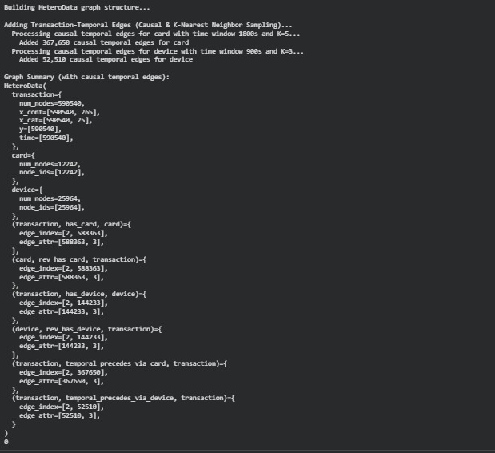
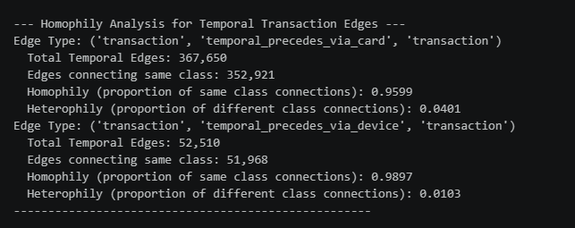
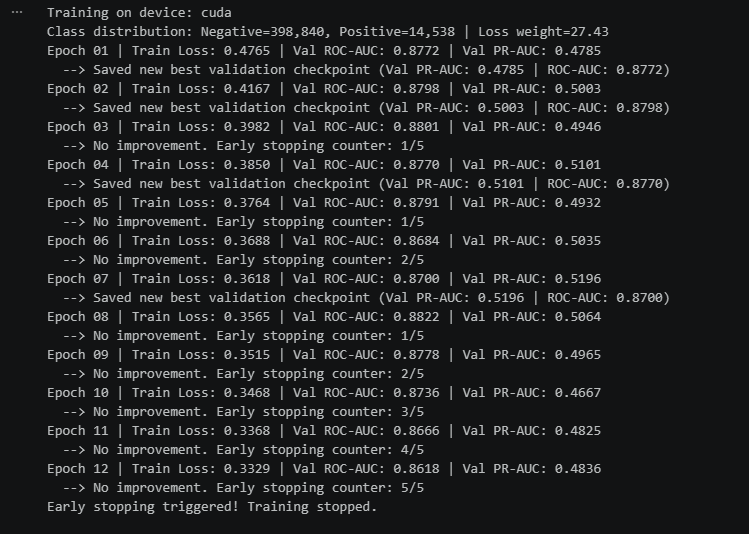
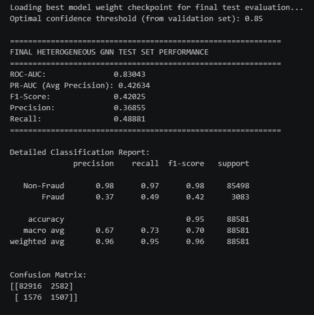
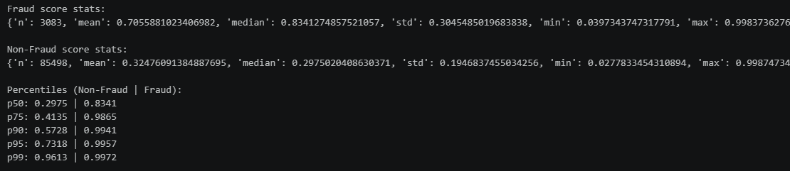
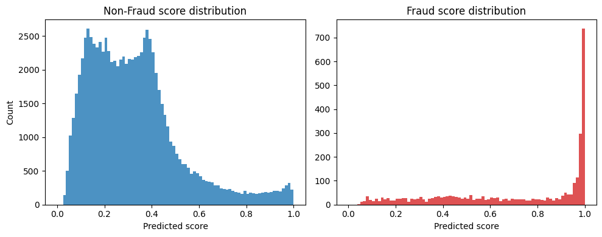

# Notebook Summary — Production-Grade Heterogeneous GNN for Fraud Detection

This document describes the actions performed in each cell of the notebook Copy_of_Yet_another_copy_of_Fraud_Detection_After_Feature_Engineering_v3.ipynb and provides a screenshot placeholder for the results produced by each cell. Place your screenshots in a `screenshots/` directory next to this file and replace the placeholder images with your actual screenshots.

How to use:
- Save screenshots for each cell as `screenshots/cell-01.png`, `screenshots/cell-02.png`, …
- Open this file on GitHub to display screenshots inline.

---

Summary by cell

1. Cell 1 — Markdown
- Type: Markdown
- Action: Notebook title, pipeline overview and highlights (Drive integration, heterogeneous graph construction, temporal splitting, sampling, architecture, evaluation).
- Screenshot: 

2. Cell 2 — Code
- Type: Code
- Action: Detect PyTorch/CUDA versions; install PyG and dependencies; print PyG version.
- Expected outputs: Detected PyTorch/CUDA string and PyG version.
- Screenshot: 

3. Cell 3 — Code
- Type: Code
- Action: Mount Google Drive (`drive.mount('/content/drive')`).
- Expected outputs: Drive mount confirmation and path listing.
- Screenshot: 

4. Cell 4 — Code
- Type: Code
- Action: Duplicate/more explicit Drive mount and os import (redundant mount block).
- Screenshot: 

5. Cell 5 — Code
- Type: Code
- Action: Configuration: set `BASE_DIR`, construct CSV paths and verify CSV existence.
- Expected outputs: Success/warning messages indicating whether CSVs were found.
- Screenshot: 

6. Cell 6 — Code
- Type: Code
- Action: Define `reduce_mem_usage`, `add_causal_entity_dynamics`, load transformed transaction and identity CSVs, reduce memory, create temporal encodings.
- Expected outputs: Memory reduction report; shapes of transaction and identity tables.
- Screenshot: 

7. Cell 7 — Code
- Type: Code
- Action: Text normalization (`clean_id_30`, `clean_id_31`, `clean_device_info`), create combined device fingerprints, normalize numerical ID columns, map categorical columns to indices, merge identity back to transactions, scale continuous features, map entities to indices.
- Expected outputs: Prints about normalization, mapping counts for card/device, and total continuous features count.
- Screenshot: 

8. Cell 8 — Code
- Type: Code
- Action: Build `HeteroData` graph: add `transaction`, `card`, `device` nodes and static edges (`has_card`, `has_device`), compute and add causal temporal edges per entity (card, device) with edge attributes, print graph summary, free large DataFrames.
- Expected outputs: Progress prints while adding temporal edges and final graph summary (node/edge counts and attributes).
- Screenshot: 

9. Cell 9 — Markdown
- Type: Markdown
- Action: Introduces Graph homophily/heterophily analysis for temporal edges.
- Screenshot: 

10. Cell 10 — Code
- Type: Code
- Action: Compute homophily for temporal transaction edges (card/device), print total edges, same-class connections, homophily and heterophily.
- Expected outputs: Homophily and heterophily statistics for each temporal edge type.
- Screenshot: 

11. Cell 11 — Markdown
- Type: Markdown
- Action: Notes on chronological data splitting rationale and why it prevents leakage.
- Screenshot: 

12. Cell 12 — Code
- Type: Code
- Action: Create chronological train/val/test splits by `TransactionDT`, assign boolean masks `train_mask`, `val_mask`, `test_mask` on `data['transaction']`, print split sizes.
- Expected outputs: Counts of training, validation, and testing nodes.
- Screenshot: 

13. Cell 13 — Markdown
- Type: Markdown
- Action: Describes neighbor sampling loader strategy (`NeighborLoader`) for scalable training.
- Screenshot: 

14. Cell 14 — Code
- Type: Code
- Action: Initialize `NeighborLoader` instances for train/val/test with temporal sampling (`time_attr='time'`), set neighbor sizes and batch sizes, print initialization confirmation.
- Expected outputs: `Dataloaders initialized.`
- Screenshot: 

15. Cell 15 — Code
- Type: Code
- Action: Define `Time2VecEncoding`, `RelationScaledConv`, `TemporalMemoryModule`, and auxiliary losses (`info_nce_loss`, `temporal_consistency_loss`, `anomaly_energy_loss`).
- Purpose: Provide time encoding and auxiliary modules used by the main model.
- Screenshot: 

16. Cell 16 — Code
- Type: Code
- Action: Define `HeteroGNNModel` class: projection heads, categorical embeddings, temporal memory, TransformerConv-based heterogeneous conv layers, temporal edge dropout, forward pass returning logits and auxiliary outputs.
- Screenshot: 

17. Cell 17 — Code
- Type: Code
- Action: Define `FocalLoss`, `train_epoch`, and `evaluate_model` functions used during training and validation.
- Screenshot: 

18. Cell 18 — Code
- Type: Code
- Action: Initialize device, compute class imbalance `pos_weight`, set hyperparameters, instantiate model, optimizer, criterion, scheduler; run the training loop with early stopping and checkpoint saving (`best_hetero_gnn.pt`).
- Expected outputs: Per-epoch logs (Train Loss, Val ROC-AUC, Val PR-AUC), checkpoint save messages and potential early stopping.
- Screenshot: 

19. Cell 19 — Code
- Type: Code
- Action: Subgraph framework: temporal ego-subgraph extraction, motif statistics, `TemporalSubgraphEncoder`, structural signatures and utilities for subgraph-based analysis.
- Purpose: Tools for motif analysis, causal ego-subgraphs, and subgraph contrastive encoding.
- Screenshot: 

20. Cell 20 — Code
- Type: Code
- Action: Load best checkpoint (`best_hetero_gnn.pt`), tune threshold on validation to maximize F1, evaluate on test set using chosen threshold, print final test metrics and classification report, confusion matrix.
- Expected outputs: Final ROC-AUC, PR-AUC, F1, Precision, Recall and classification report + confusion matrix.
- Screenshot: 

21. Cell 21 — Code
- Type: Code
- Action: Plot distribution of model scores for Fraud vs Non-Fraud (histograms), compute and print descriptive stats and percentiles for each group, display matplotlib figure.
- Expected outputs: Numeric statistics and a two-panel histogram figure.
 - Screenshot: 
 - Screenshot: 

22. Cell 22 — Code
- Type: Code
- Action: Hard negative mining and analysis: collect predictions per split, build transaction context, summarize high-confidence false positives, cluster communities, build stage-2 dataset and calibrate scores, train stage-2 false-positive suppressor and evaluate it.
- Expected outputs: Counts of mined hard negatives, clustering summaries, calibration diagnostics, stage-2 training logs and evaluation metrics (ROC-AUC, PR-AUC, F1, ECE, classification report).
- Screenshot: 

23. Cell 23 — Code
- Type: Code
- Action: Cascade evaluation: combine stage-1 probabilities and stage-2 suppressor probabilities to compute cascade scores; report cascade ROC-AUC, PR-AUC, ECE and classification results; show suppression statistics for mined false positives.
- Expected outputs: Cascade performance metrics and confusion matrix.
- Screenshot: 

---

Notes and next steps

- Replace each `screenshots/cell-XX.png` placeholder with the actual screenshot for that cell's output.
- Optionally crop each screenshot to the important output region (tables, printed metrics, or plotted figures) before committing to GitHub.
- If you want, I can extract inline image outputs embedded in the notebook (if present) and write them into the `screenshots/` folder automatically — tell me if you want me to do that.

File created: Notebook_Summary.md

